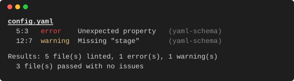

# yaml-schema-lint

[![npm][npm-badge]][npm-listing]
[![npm downloads][npm-downloads]][npm-listing]

Lint YAML files against JSON schemas using the [yaml-language-server](https://www.npmjs.com/package/yaml-language-server) programmatic API.
Validates syntax and schema compliance, with schemas loaded from a settings file and [schemastore.org](https://www.schemastore.org/).

## Installation

```bash
npm install --global yaml-schema-lint
```

## Usage

```bash
yaml-schema-lint [options] <patterns...>
```

### Arguments

| Argument        | Description                                                                                               |
| --------------- | --------------------------------------------------------------------------------------------------------- |
| `<patterns...>` | One or more YAML file paths or glob patterns. Quote globs to prevent shell expansion (e.g. `'**/*.yml'`). |

### Options

| Option                       | Default                   | Description                                                                               |
| ---------------------------- | ------------------------- | ----------------------------------------------------------------------------------------- |
| `--settings-path <path>`     | `.vscode/settings.json`   | Path to a JSON settings file containing `yaml.schemas` and `yaml.customTags`.             |
| `--no-schema-store`          | _(enabled)_               | Disable fetching schemas from schemastore.org.                                            |
| `--cache-dir <path>`         | `.cache/yaml-schema-lint` | Directory for caching the Schema Store catalog.                                           |
| `--cache-ttl <seconds>`      | `86400` (24h)             | How long the cached Schema Store catalog is considered fresh.                             |
| `--max-retry-wait <seconds>` | `60`                      | Maximum total wait between retries of one schema or catalog fetch. `0` disables retrying. |
| `--format <name>`            | `gitlab-codequality`      | Output file format when `--output-file` is used (`gitlab-codequality`, `json`).           |
| `--output-file <path>`       | _(none)_                  | Write an additional report file in the chosen format.                                     |
| `--ignore <patterns>`        | `**/node_modules/**`      | Comma-separated glob patterns to exclude from file matching.                              |
| `--no-fail-on-warnings`      | _(disabled)_              | Do not exit with an error when only warnings are found.                                   |
| `--no-fail-on-no-files`      | _(disabled)_              | Exit successfully when no files match the patterns.                                       |
| `--debug`                    | `false`                   | Enable debug logging.                                                                     |

## Examples

```bash
yaml-schema-lint '**/*.yml' '**/*.yaml'
yaml-schema-lint --settings-path custom/settings.json '**/*.yml'
yaml-schema-lint --no-schema-store '**/*.yml'
yaml-schema-lint --ignore 'dist/**,build/**' '**/*.yml'
yaml-schema-lint '**/*.yml' --output-file gl-codequality.json
```

## Schema resolution

Schemas are resolved from three sources, in order of priority:

1. **Settings file** -- The `yaml.schemas` property maps schema URIs to file glob patterns. Custom YAML tags can be defined via `yaml.customTags`.

   ```json
   {
     "yaml.schemas": {
       "https://json.schemastore.org/gitlab-ci": [".gitlab-ci.yml", "gitlab/*.yml"]
     },
     "yaml.customTags": ["!reference sequence"]
   }
   ```

2. **Schema Store** -- YAML-relevant schemas are automatically fetched from [schemastore.org](https://www.schemastore.org/) and matched against file names. The catalog is cached locally (default: `.cache/yaml-schema-lint/schemastore-catalog.json`) with a configurable TTL. Disable with `--no-schema-store`. If the catalog cannot be fetched even after the retries described below, the run exits with code 1 and a readable error.

3. **Modeline comments** -- Inline schema declarations in YAML files are supported natively by the language server:

   ```yaml
   # yaml-language-server: $schema=https://json.schemastore.org/github-workflow.json
   name: CI
   on: push
   ```

### Network retries

Fetching a remote schema or the Schema Store catalog is retried up to 4 times when the failure looks temporary: an HTTP `429`, `500`, `502`, `503` or `504`, or a connection-level failure such as a refused, reset or unresolved connection. Other responses such as `404`, `403` or `501` are not retried.

The delay before each retry depends on the failure:

- **`Retry-After`** -- A server-supplied `Retry-After` header is honoured, provided it fits in the remaining retry wait. If the server asks for a longer wait, the fetch gives up immediately rather than retrying before the server says it will succeed.
- **`429 Too Many Requests`** -- Rate limits are usually enforced over a window of a minute or so, so retrying within seconds cannot succeed. Without `Retry-After`, the delay grows exponentially with jitter from 10 s, capped at 30 s per attempt.
- **`500`, `502`, `503`, `504` and connection failures** -- These are usually short-lived (a restarting backend, a failover or a dropped connection). Without `Retry-After`, the delay grows exponentially with jitter from 1 s, about 7.5-15 s in total.

The total time spent waiting between attempts of one fetch is capped by `--max-retry-wait` (default 60 s). The Schema Store catalog is fetched before any schema, so a run can wait up to twice this limit in the worst case.

## Output

By default, human-readable diagnostics are printed to the console with colorized severity and summary:



### Report files

When `--output-file` is provided, an additional report file is written in the format selected by `--format`. The console output still runs.

#### `gitlab-codequality`

Produces a JSON array conforming to the [GitLab Code Quality report format](https://docs.gitlab.com/ci/testing/code_quality/#code-quality-report-format)

Severity mapping:

| yaml-language-server | GitLab Code Quality |
| -------------------- | ------------------- |
| Error                | `major`             |
| Warning              | `minor`             |
| Information          | `info`              |
| Hint                 | `info`              |

#### `json`

Produces a JSON array of per-file results with 1-based line/column numbers and string severity values. This format is consumed by the [GitHub Action](https://github.com/X-Guardian/yaml-schema-lint-action) to create Check Runs.

Severity mapping:

| yaml-language-server | JSON          |
| -------------------- | ------------- |
| Error                | `error`       |
| Warning              | `warning`     |
| Information          | `information` |
| Hint                 | `hint`        |

## Exit codes

| Code | Meaning                                                                                                                                                    |
| ---- | ---------------------------------------------------------------------------------------------------------------------------------------------------------- |
| `0`  | All files passed with no errors or warnings, or `--no-fail-on-warnings` is set and no errors were found, or no files matched with `--no-fail-on-no-files`. |
| `1`  | At least one error or warning was found (default), no files matched (default), or a fatal error occurred.                                                  |

## CI integration

### GitLab CI

```yaml
yaml-lint:
  stage: validate
  image: node:24-slim
  script:
    - npx yaml-schema-lint '**/*.yml' --format gitlab-codequality --output-file gl-codequality.json
  artifacts:
    reports:
      codequality: gl-codequality.json
```

### GitHub Actions

The [yaml-schema-lint-action](https://github.com/X-Guardian/yaml-schema-lint-action) runs yaml-schema-lint and creates a GitHub Check with inline annotations and a markdown summary:

```yaml
yaml-lint:
  runs-on: ubuntu-latest
  permissions:
    contents: read
    checks: write
    pull-requests: read
  steps:
    - uses: actions/checkout@v4

    - uses: X-Guardian/yaml-schema-lint-action@v1
      with:
        patterns: "'**/*.yml' '**/*.yaml'"
```

See the [action README](https://github.com/X-Guardian/yaml-schema-lint-action) for all available inputs.

## License

MIT

[npm-badge]: https://img.shields.io/npm/v/yaml-schema-lint.svg
[npm-listing]: https://www.npmjs.com/package/yaml-schema-lint
[npm-downloads]: https://img.shields.io/npm/dm/yaml-schema-lint.svg
